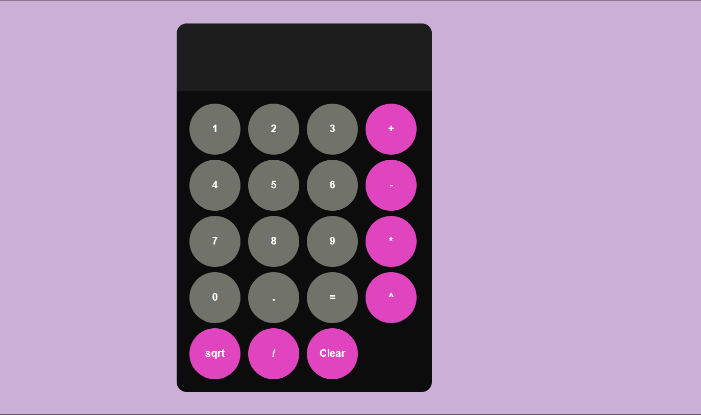

# 🧮 Luyanda's Calculator

A sleek, functional calculator web application with modern design and advanced operations. Perfect for everyday calculations with style!

## 🌟 Features

- **Basic Operations**: 
  - Addition (+), Subtraction (-), Multiplication (×), Division (÷)
- **Advanced Functions**:
  - Exponentiation (^)
  - Square roots (√)
- **User Experience**:
  - Large, high-contrast display
  - Color-coded operator buttons
  - Tactile circular buttons with hover effects
  - Responsive design for all devices
- **Smart Features**:
  - Automatic parenthesis completion for square roots
  - Error handling for invalid operations

## 🚀 Live Demo

Experience the calculator here:  
👉 [https://luyandaaaa.github.io/_Calculator-/](https://luyandaaaa.github.io/_Calculator-/)

## 🛠️ Technologies

- **Frontend**:
  - HTML5 (Semantic structure)
  - CSS3 (Flexbox, Grid, Animations)
  - JavaScript (ES6 with clean, efficient logic)

## 📁 Project Structure
_Calculator-/ < br/>
├── index.html # Main application interface < br/>
├── style.css # Stylish presentation < br/>
├── script.js # Interactive functionality < br/>
├── calculator.png # Application screenshot < br/>
└── README.md # Project documentation < br/>

# 💻 Usage Guide

### Basic Operations
1. Click number buttons (0-9) to input values
2. Select an operation (+, -, ×, ÷)
3. Press "=" for result
4. Use "Clear" to reset

### Advanced Functions
- **Exponents**: 2^3 = 8
- **Square Roots**: √(9) = 3
- **Decimal Calculations**: 5.2 + 3.8 = 9

### Pro Tips
- The calculator automatically closes unclosed square root parentheses
- You can chain multiple operations: 5 + 3 × 2 = 11
📜 License
MIT © Luyanda

💖 Enjoy calculating!
📧 For questions or feedback, please open an issue on GitHub.
